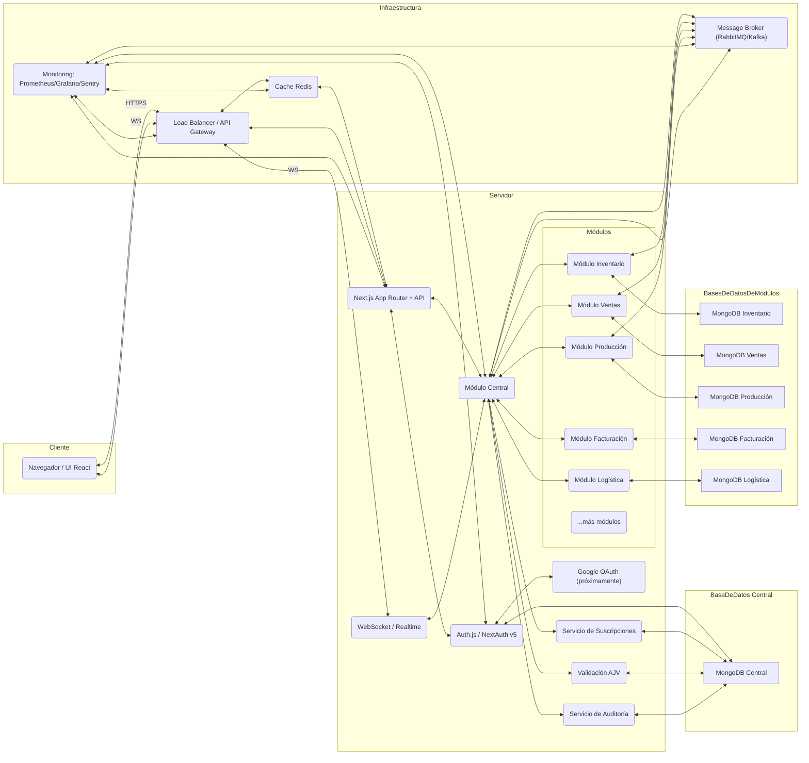

# 🏭 CoreFoundry

[](LICENSE)

**CoreFoundry** es un ERP modular full-stack construido con Next.js (App Router + API integrada) y diseñado para que cada módulo (Inventario, Ventas, Producción, etc.) se desarrolle y despliegue de forma independiente, orquestado por un **Módulo Central** que gestiona:

- Gestión de usuarios, roles (Owner, Empleado, Super-Admin) y planes de suscripción (Free, Pro, Enterprise).  
- Registro dinámico de módulos y conexiones seguras entre ellos.  
- Flujos de datos validados y comunicación entre módulos.  
- Trazabilidad y auditoría de acciones con logs TTL (expireAfterSeconds de 30 días).

## 📊 Arquitectura del Sistema



---

## 🔑 Gestión de Usuarios y Subscripciones

El **Módulo Central** gestiona:

1. **Autenticación y registros**:
   - Registro y login con usuario/contraseña (JWT o sesiones).
   - (Próximamente) Login con Google u otros proveedores OAuth.

2. **Perfiles y roles**:
   - **Owner**: administra la cuenta, usuarios y suscripciones.
   - **Empleado**: roles específicos (ventas, inventario, etc.).
   - **Super Admin** (equipo interno): acceso completo.

3. **Planes y módulos habilitados**:
   - Define planes (Free, Pro, Enterprise) que habilitan cierto conjunto de módulos.
   - Controla acceso a módulos según plan y periodo de suscripción.

4. **Seguridad y auditoría**:
   - Validación de JWT en cada request.
   - Cifrado en tránsito (HTTPS/WSS).
   - Logs de auditoría para trazabilidad de flujos y acciones.

---

## 📦 Requisitos Previos

- **Node.js** ≥ 20.x
- **npm** o **Yarn**
- **MongoDB** ≥ 6.x (local o Atlas)
- (Opcional) Docker y Docker Compose

---
## 🛠️ Instalación Local

1. Clona este repositorio:

   ```bash
   git clone https://github.com/tu-org/corefoundry.git
   cd corefoundry
   ```

2. Instala las dependencias:

   ```bash
   npm install
   # o
   yarn install
   ```

3. Crea `.env.local` a partir del ejemplo:

   ```bash
   cp .env.example .env.local
   ```

4. Define las variables:

   ```ini
   MONGODB_URI=mongodb://localhost:27017/corefoundry
   NEXTAUTH_SECRET=tu_clave_segura
   JWT_SECRET=tu_clave_segura
   ```

5. Arranca en modo desarrollo:

   ```bash
   npm run dev
   ```

6. Abre [http://localhost:3000](http://localhost:3000).

---
## ✨ Tecnologías Clave

- **Next.js** (App Router, Server Components, API Routes)  
- **React + TypeScript**  
- **Zustand** (estado global ligero)  
- **TanStack Query** (fetching, caché y sincronización)  
- **MongoDB + Mongoose** (+ mongoose-paginate-v2)  
- **Auth.js (NextAuth v5)** (JWT/sesiones)  
- **AJV** (validación de esquemas JSON)  
- **Framer Motion** (animaciones UI)  
- **Tailwind CSS** (estilos)

---

## 🧩 Características Principales

- 📦 **Módulo Central**: orquesta usuarios, suscripciones, módulos y conexiones.  
- 🔗 **Conexiones Seguras**: define flujos entre módulos usando datos validados por AJV.  
- 🧱 **Modularidad Extrema**: cada módulo dispone de su esquema, endpoints y UI propios.  
- 🔒 **Seguridad y Auditaría**: JWT en cada request, cifrado HTTPS/WSS, logs de auditoría (acción, payload, resultado, IP, userAgent).  
- 📊 **Logs TTL**: los registros de auditoría expiran automáticamente tras 30 días.  
- 💬 **Componentes UX**: Chat en tiempo real (ChatWidget), scroll infinito (InfiniteScroller), menús de usuario (AuthMenu), formularios de auth (AuthForm).  
- 📄 **Páginas Estáticas**: landing, privacidad, términos, perfil.

---

## 📂 Estructura del Proyecto

```
/
├── src/
│   ├── app/               # Rutas, layouts y API routes
│   ├── components/        # Componentes React compartidos (AuthForm, AuthMenu, ChatWidget...)
│   ├── hooks/             # Hooks personalizados (useAuth, useModules...)
│   ├── lib/               # Utilidades (conexión Mongo, validaciones AJV)
│   ├── models/            # Esquemas Mongoose (User, Module, ModuleLink, AuditLog)
│   └── store/             # Zustand stores
├── public/                # Assets estáticos
├── .env.example           # Variables de entorno de ejemplo
├── README.md
├── CHANGELOG.md
└── LICENSE
```

---

## 📡 API Endpoints

### Autenticación y Usuarios

- `POST /api/auth/register`  – Registro de usuario  
- `POST /api/auth/login`     – Inicio de sesión  
- `GET  /api/auth/session`   – Información de sesión activa

### Módulos y Conexiones

- `GET  /api/modules`           – Listar módulos registrados  
- `POST /api/modules/register`  – Registrar nuevo módulo  
- `POST /api/modules/connect`   – Conectar dos módulos  
- `GET  /api/moduleLinks`       – Listar flujos configurados

### Auditoría

- `GET /api/auditLogs`         – Consultar logs de operaciones

---

## 🛠️ Comandos Útiles

- **Desarrollo**: `npm run dev`  
- **Build producción**: `npm run build && npm start`  
- **Lint**: `npm run lint`  
- **Tests**: `npm run test`  

---

## 🚀 Despliegue con Docker (Opcional)

1. `docker build -t corefoundry .`  
2. `docker-compose up -d`

> En el futuro, se podrá desplegar en Kubernetes con Helm.

---

## 🤝 Contribuciones

1. Haz fork del repositorio.  
2. Crea una rama (`feature/...`).  
3. Añade pruebas y documentación.  
4. Abre un Pull Request describiendo tu cambio.

---

## 📜 Licencia

MIT © Tu Organización

---

## 📅 Changelog

Consulta [CHANGELOG.md](./CHANGELOG.md) para ver cambios recientes.
