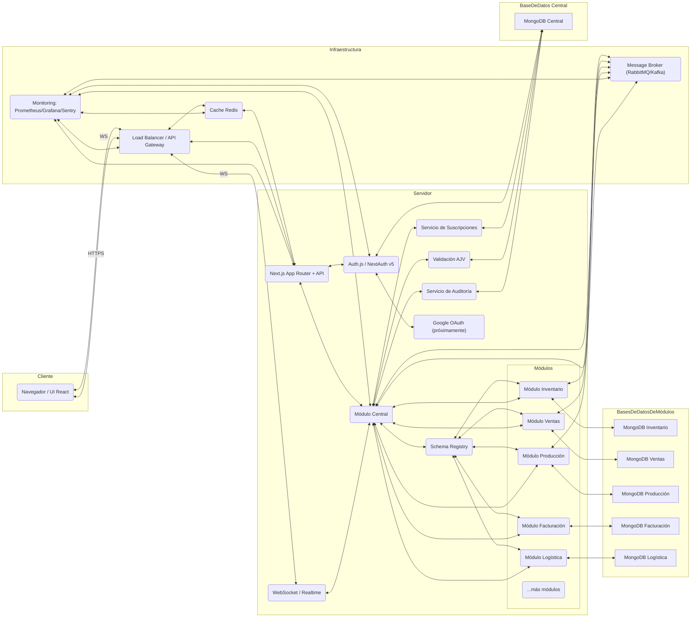

# 🏭 CoreFoundry

[](LICENSE)

**CoreFoundry** es un ERP modular full-stack construido con Next.js (App Router + API integrada) y diseñado para que cada módulo (Inventario, Ventas, Producción, etc.) se desarrolle y despliegue de forma independiente, orquestado por un **Módulo Central** que gestiona:

- Gestión de usuarios, roles (Owner, Empleado, Super-Admin) y planes de suscripción (Free, Pro, Enterprise).  
- Registro dinámico de módulos y conexiones seguras entre ellos.  
- Flujos de datos validados y comunicación entre módulos.  
- Trazabilidad y auditoría de acciones con logs TTL (expireAfterSeconds de 30 días).

## 📊 Arquitectura del Sistema


```mermaid
flowchart LR
  subgraph Infraestructura
    LB("Load Balancer / API Gateway")
    Cache("Cache Redis")
    Broker("Message Broker (RabbitMQ/Kafka)")
    Monitoring("Monitoring: Prometheus/Grafana/Sentry")
  end
  subgraph Cliente
    Browser("Navegador / UI React")
  end
  subgraph Servidor
    NextJS("Next.js App Router + API")
    AuthModule("Auth.js / NextAuth v5")
    CoreModule("Módulo Central")
    SubscriptionService("Servicio de Suscripciones")
    ValidationService("Validación AJV")
    AuditService("Servicio de Auditoría")
    SchemaRegistry("Schema Registry")
    WS("WebSocket / Realtime")
    subgraph Módulos
      InventoryModule("Módulo Inventario")
      SalesModule("Módulo Ventas")
      ProductionModule("Módulo Producción")
      BillingModule("Módulo Facturación")
      LogisticsModule("Módulo Logística")
      MoreModules("...más módulos")
    end
    OAuthGOOGLE("Google OAuth (próximamente)")
  end
  subgraph BaseDeDatos Central
    CentralDB["MongoDB Central"]
  end
  subgraph BasesDeDatosDeMódulos
    InvDB["MongoDB Inventario"]
    SalesDB["MongoDB Ventas"]
    ProdDB["MongoDB Producción"]
    BillDB["MongoDB Facturación"]
    LogiDB["MongoDB Logística"]
  end

  Browser <-->|HTTPS| LB
  LB <--> Cache
  Cache <--> NextJS
  LB <--> NextJS
  NextJS <--> AuthModule
  AuthModule <--> CentralDB
  AuthModule <--> OAuthGOOGLE
  NextJS <--> CoreModule
  CoreModule <--> SubscriptionService
  SubscriptionService <--> CentralDB
  CoreModule <--> ValidationService
  ValidationService <--> CentralDB
    CoreModule <--> AuditService
    AuditService <--> CentralDB
    CoreModule <--> SchemaRegistry
    SchemaRegistry <--> InventoryModule
    SchemaRegistry <--> SalesModule
    SchemaRegistry <--> ProductionModule
    SchemaRegistry <--> BillingModule
    SchemaRegistry <--> LogisticsModule
    Browser <-->|WS| LB
  LB <-->|WS| WS
  WS <--> CoreModule
  CoreModule <--> InventoryModule
  CoreModule <--> SalesModule
  CoreModule <--> ProductionModule
  CoreModule <--> BillingModule
  CoreModule <--> LogisticsModule
  InventoryModule <--> InvDB
  SalesModule <--> SalesDB
  ProductionModule <--> ProdDB
  BillingModule <--> BillDB
  LogisticsModule <--> LogiDB
  CoreModule <--> Broker
  InventoryModule <--> Broker
  SalesModule <--> Broker
  ProductionModule <--> Broker
  Broker <--> CoreModule
  Monitoring <--> LB
  Monitoring <--> NextJS
  Monitoring <--> AuthModule
  Monitoring <--> CoreModule
  Monitoring <--> Broker
  Monitoring <--> Cache
```

---

## 🧾 Contrato y Versionado de Módulos

Cada módulo debe proporcionar un **manifest** JSON con metadatos clave (nombre, versión, endpoints, esquemas y eventos). El Módulo Central valida este manifest con AJV y lo almacena en un **Schema Registry** para facilitar la compatibilidad entre versiones.

### Ejemplo de `module.manifest.json`

```json
{
  "name": "inventory",
  "version": "1.0.0",
  "endpoints": { "rest": "https://inventory.local/api" },
  "schemas": { "product": { "$id": "#/product", "type": "object" } },
  "events": { "publish": ["stock.updated"], "subscribe": ["order.created"] }
}
```

### Flujo de registro y actualización

1. El módulo envía su manifest al endpoint de registro del Módulo Central.
2. El manifest se valida con `moduleManifestSchema` mediante AJV.
3. Si es válido, se persiste y se agrega una entrada en `manifestHistory` con la versión.
4. Para actualizar, el módulo envía un nuevo manifest con versión incrementada y el proceso se repite.

#### Ejemplo de actualización

```json
{
  "name": "inventory",
  "version": "1.1.0",
  "endpoints": {
    "rest": "https://inventory.local/api",
    "ws": "wss://inventory.local/ws"
  },
  "schemas": { "product": { "$id": "#/product", "type": "object" } },
  "dependencies": ["sales"],
  "events": {
    "publish": ["stock.updated"],
    "subscribe": ["order.created"]
  }
}
```

### Registro y descubrimiento de módulos

Los módulos se integran con el Módulo Central registrando su manifest a
través del endpoint `POST /api/modules/register`. La respuesta incluye un
`integrationToken` que identifica al módulo en futuras interacciones.

Para consultar los módulos disponibles y su metadata básica, se expone el
endpoint `GET /api/modules`, que devuelve un listado con todos los módulos
registrados.

### Validación y manejo de errores

`validateManifest` devuelve `false` si el manifest no cumple el contrato y
expone los detalles de validación en `validateManifest.errors`. Cada error
incluye un `instancePath` con la ruta al campo problemático y un `message`
legible. Se recomienda transformar estos objetos en mensajes claros antes de
mostrarlos a los autores del módulo:

```ts
if (!validateManifest(manifest)) {
  const msgs = (validateManifest.errors ?? []).map(
    (e) => `${e.instancePath || e.params.missingProperty}: ${e.message}`,
  );
  throw new Error(`Manifest inválido:\n${msgs.join('\n')}`);
}
```

También puede utilizarse `ajv.errorsText(validateManifest.errors)` para generar
un resumen legible de todos los problemas detectados.

## 🔍 Descubrimiento y Comunicación

- **Registro inicial**: los módulos se registran vía HTTP enviando su manifest.
- **Schema Registry**: expone los esquemas y versiones para que otros módulos puedan consultarlos.
- **Broker de mensajes**: los eventos de negocio se publican/suscriben mediante RabbitMQ/Kafka.
- **Endpoints HTTP**: se usan para operaciones sincrónicas declaradas en el manifest.
- **Seguridad**: los tokens y permisos se propagan entre módulos y se auditan todas las llamadas.

### Event Bus

La comunicación asíncrona se realiza a través de un exchange de tipo *topic*
llamado `core.events`. Cada servicio crea su propia cola siguiendo el patrón
`core.events.<servicio>` y la enlaza a las claves de enrutamiento de los
eventos que consume.

Los mensajes publicados deben respetar la siguiente convención:

```json
{
  "type": "nombre.evento",
  "payload": { "...": "" }
}
```

`type` describe el evento y `payload` contiene los datos asociados.

---

## 🔑 Gestión de Usuarios y Subscripciones

El **Módulo Central** gestiona:

1. **Autenticación y registros**:
   - Registro y login con usuario/contraseña (JWT o sesiones).
   - (Próximamente) Login con Google u otros proveedores OAuth.

2. **Perfiles y roles**:
   - **Owner**: administra la cuenta, usuarios y suscripciones.
   - **Empleado**: roles específicos (ventas, inventario, etc.).
   - **Super Admin** (equipo interno): acceso completo.

3. **Planes y módulos habilitados**:
   - Define planes (Free, Pro, Enterprise) que habilitan cierto conjunto de módulos.
   - Controla acceso a módulos según plan y periodo de suscripción.

4. **Seguridad y auditoría**:
   - Validación de JWT en cada request.
   - Cifrado en tránsito (HTTPS/WSS).
   - Logs de auditoría para trazabilidad de flujos y acciones.

---

## 📦 Requisitos Previos

- **Node.js** ≥ 20.x
- **npm** o **Yarn**
- **MongoDB** ≥ 6.x (local o Atlas)
- (Opcional) Docker y Docker Compose

---
## 🛠️ Instalación Local

1. Clona este repositorio:

   ```bash
   git clone https://github.com/tu-org/corefoundry.git
   cd corefoundry
   ```

2. Instala las dependencias:

   ```bash
   npm install
   # o
   yarn install
   ```

3. Crea `.env.local` a partir del ejemplo:

   ```bash
   cp .env.example .env.local
   ```

4. Define las variables:

   ```ini
   MONGODB_URI=mongodb://localhost:27017/corefoundry
   NEXTAUTH_SECRET=tu_clave_segura
   JWT_SECRET=tu_clave_segura
   ```

5. Arranca en modo desarrollo:

   ```bash
   npm run dev
   ```

6. Abre [http://localhost:3000](http://localhost:3000).

---
## ✨ Tecnologías Clave

- **Next.js** (App Router, Server Components, API Routes)  
- **React + TypeScript**  
- **Zustand** (estado global ligero)  
- **TanStack Query** (fetching, caché y sincronización)  
- **MongoDB + Mongoose** (+ mongoose-paginate-v2)  
- **Auth.js (NextAuth v5)** (JWT/sesiones)  
- **AJV** (validación de esquemas JSON)  
- **Framer Motion** (animaciones UI)  
- **Tailwind CSS** (estilos)

---

## 🧩 Características Principales

- 📦 **Módulo Central**: orquesta usuarios, suscripciones, módulos y conexiones.
- 🔗 **Conexiones Seguras**: define flujos entre módulos usando datos validados por AJV.
- 🧱 **Modularidad Extrema**: cada módulo dispone de su esquema, endpoints y UI propios.
- 📄 **Manifest de Módulos**: contrato versionado con endpoints, esquemas y eventos.
- 🔒 **Seguridad y Auditaría**: JWT en cada request, cifrado HTTPS/WSS, logs de auditoría (acción, payload, resultado, IP, userAgent).
- 📊 **Logs TTL**: los registros de auditoría expiran automáticamente tras 30 días.  
- 💬 **Componentes UX**: Chat en tiempo real (ChatWidget), scroll infinito (InfiniteScroller), menús de usuario (AuthMenu), formularios de auth (AuthForm).  
- 📄 **Páginas Estáticas**: landing, privacidad, términos, perfil.

---

## 📂 Estructura del Proyecto

```
/
├── src/
│   ├── app/               # Rutas, layouts y API routes
│   ├── components/        # Componentes React compartidos (AuthForm, AuthMenu, ChatWidget...)
│   ├── hooks/             # Hooks personalizados (useAuth, useModules...)
│   ├── lib/               # Utilidades (conexión Mongo, manifest de módulos)
│   ├── models/            # Esquemas Mongoose (User, Module, ModuleLink, AuditLog)
│   └── store/             # Zustand stores
├── public/                # Assets estáticos
├── .env.example           # Variables de entorno de ejemplo
├── README.md
├── CHANGELOG.md
└── LICENSE
```

---

## 📡 API Endpoints

### Autenticación y Usuarios

- `POST /api/auth/register`  – Registro de usuario  
- `POST /api/auth/login`     – Inicio de sesión  
- `GET  /api/auth/session`   – Información de sesión activa

### Módulos y Conexiones

- `GET  /api/modules`           – Listar módulos registrados  
- `POST /api/modules/register`  – Registrar nuevo módulo  
- `POST /api/modules/connect`   – Conectar dos módulos  
- `GET  /api/moduleLinks`       – Listar flujos configurados

### Auditoría

- `GET /api/auditLogs`         – Consultar logs de operaciones

## 🔐 Scopes de Módulos

Los módulos registrados pueden declarar un arreglo `scopes` con los permisos que tienen habilitados.
Un middleware para todas las rutas bajo `/api` verifica que el módulo que realiza la solicitud
esté identificado mediante el encabezado `X-Module-Id` y que posea todos los scopes indicados en
`X-Module-Scopes`.

Consulta [docs/security.md](./docs/security.md) para más detalles sobre la configuración y uso de scopes.

---

## 🛠️ Comandos Útiles

- **Desarrollo**: `npm run dev`  
- **Build producción**: `npm run build && npm start`  
- **Lint**: `npm run lint`  
- **Tests**: `npm run test`  
- **CLI de Módulos**: `npx module-cli init <nombre>` – crea la estructura base de un módulo [guía](./docs/module-cli.md)

---

## 🚀 Despliegue con Docker (Opcional)

1. `docker build -t corefoundry .`  
2. `docker-compose up -d`

> En el futuro, se podrá desplegar en Kubernetes con Helm.

---

## 🤝 Contribuciones

1. Haz fork del repositorio.  
2. Crea una rama (`feature/...`).  
3. Añade pruebas y documentación.  
4. Abre un Pull Request describiendo tu cambio.

---

## 📜 Licencia

MIT © Tu Organización

---

## 📅 Changelog

Consulta [CHANGELOG.md](./CHANGELOG.md) para ver cambios recientes.
